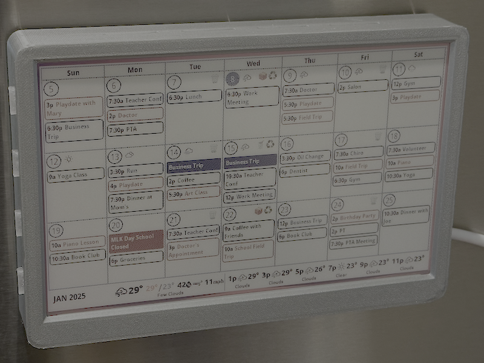

# Piinky

Piinky is a calendar display for the fridge.



During COVID I built a little magnetic Waveshare e-ink weather gadget + Pi Zero W.


It still works well, but what if it had our family calendars on it? It'd need a bigger multi-color capable display.

Piinky was the answer and my winter break 2024 project.


## Hardware Requirements

### Raspberry Pi

Unfortunately, even the Raspberry Pi Zero 2 W is too RAM-limited to run the Chrome or Firefox headless drivers and load the React frontend using the Playwright screenshot package, so grab a [Raspberry Pi 5](https://www.microcenter.com/product/683269/raspberry-pi-5) and feel the power.

(TODO: Try running the frontend with SSR to reduce the page complexity when loading it headless, and try again on the Zero 2 W)

(A Pi 4 or even a Pi 3B+ could probably handle the screenshots, but they are not what I had available.)

Download [Raspberry Pi Imager](https://www.raspberrypi.com/software/) and create an SD card image of the latest 64-bit OS with Desktop available. Would the Lite version work? Maybe, but the Desktop is foolproof. Also, be sure to set up your Wi-Fi network and a user in the Imager options.

### Pimoroni Inky Impression 7.3" e-ink display

Pimoroni makes a few different sized Inky displays, but the [Inky Impression 7.3"](<https://www.microcenter.com/product/631630/pimoroni-inky-impression-(7-colour-epaper-eink-epd)>) one is the perfect size and shape for a multi-week calendar.

On your Pi, install the required packages and enable SPI:

```bash
# Enable SPI interface
sudo raspi-config nonint do_spi 0
sudo raspi-config nonint do_i2c 0

# Install required packages
sudo apt-get update
sudo apt-get install -y python3-pip python3-rpi.gpio python3-spidev python3-pil python3-numpy
```

Edit your `config.txt` file to enable SPI:
```
sudo vi /boot/firmware/config.txt

# Add this line near the bottom of the file:
dtoverlay=spi0-0cs
```

Now reboot your Pi:
```bash
sudo reboot
```
Log in again and set up your development environment:

```bash
cd ~
mkdir dev
cd dev
git clone https://github.com/coreyk/piinky.git
cd piinky
```

## Software Setup

### Google Calendar

#### Get credentials
1. Open [Google Cloud Console](https://console.cloud.google.com)
2. Selected an existing project, or create a new project for Piinky
3. Open [APIs & Services > Credentials](https://console.cloud.google.com/apis/credentials)
4. Under **Service Accounts** click [Manage Service Accounts](https://console.cloud.google.com/iam-admin/serviceaccounts)
5. Add a new service account by clicking **+ Create Service Account** in the header nav
6. Under **Service Account Details**, name it `piinky` or something memorable, skip to the bottom and click **Done** (not Create and Continue)
7. Click the Service Account just created, go to the **Keys** tab, click **Add Key > Create new key**
8. Select the JSON Key type and click **Create**
9. The JSON key file will be downloaded
10. Move and rename the JSON file to `~/dev/piinky/google_credentials.json`

#### Share your calendar with Piinky
1. Open [Google Calendar](https://calendar.google.com/calendar/u/0/r/month)
2. In the sidebar, click **Options > Settings and sharing** for a calendar you want to use with Piinky
3. Under **Share with specific people or groups** click **+ Add people and groups**
4. Start typing the name of the Service Account you just created and autocomplete will display it. The account email should end in **.iam.gserviceaccount.com**
5. Select **See all event details** under Permissions and click **Send**
6. Scroll down to **Integrate Calendar** and find the the Calendar ID (we'll come back to it in the next section)

#### Add the calendar to Piinky
1. Copy `~/dev/piinky/google_calendar_config.json.example` to `~/dev/piinky/google_calendar_config.json` and edit it
2. Copy the **Calendar ID** from the previous step and paste it into one of the `calendar_id` values
3. Optionally, pick a new color from the **colorMap** in `~/dev/piinky/frontend/src/lib/colormap.ts`

#### Optional: Recycling & Trash calendar
1. If you have a split municipal recycling pickup schedule for cardboard and cans/plastic like I do, find it and if they have a PDF, download it. Note your trash pickup schedule, too.
2. Using [Claude AI](https://claude.ai) or your file upload-capable LLM of choice, upload the calendar PDF and ask it to create an `.ical` file with all-day events with a prompt like:
```
Create an iCal or other importable file for Google Calendar based on this PDF of recycling collection days. If the icon on Wednesday is a bundle of newspapers, create an all-day event titled "Cardboard". If the icon on Wednesday is a bucket of bottles, create an all-day event titled "Cans". Add an all-day event every Tuesday and Friday titled "Trash", as well.
```
3. Alternatively, if you don't have a calendar PDF, just prompt it to create an `.ical` file based on your schedule of **Cans**, **Cardboard**, and **Trash**.

### OpenWeatherMaps

1. Create an [OpenWeatherMap account](https://home.openweathermap.org/users/sign_up)
2. Go to your [API keys](https://home.openweathermap.org/api_keys) page
3. Generate a new API key for the 3.0 API
4. Copy the key and add it to your configuration file: `~/dev/piinky/owm_config.json`

Note: You'll have to enter billing info but you get 1000 requests per day for free, which is more than enough for Piinky.

### Frontend Setup (React + Vite)

Install Node.js 23.x on the Raspberry Pi:
```bash
# Add NodeSource repository
sudo apt-get update
sudo apt-get install -y ca-certificates curl gnupg
sudo mkdir -p /etc/apt/keyrings
curl -fsSL https://deb.nodesource.com/gpgkey/nodesource-repo.gpg.key | sudo gpg --dearmor -o /etc/apt/keyrings/nodesource.gpg
echo "deb [signed-by=/etc/apt/keyrings/nodesource.gpg] https://deb.nodesource.com/node_23.x nodistro main" | sudo tee /etc/apt/sources.list.d/nodesource.list

# Install Node.js
sudo apt-get update
sudo apt-get install -y nodejs

# Install frontend dependencies
cd frontend
npm install
```

### Backend Setup (Go)

Install Go on the Raspberry Pi:
```bash
cd ~/dev
# Download Go
wget https://go.dev/dl/go1.23.4.linux-arm64.tar.gz

# Install Go
sudo tar -C /usr/local -xzf go1.23.4.linux-arm64.tar.gz

# Add Go to your path (add to .zshrc, .bashrc, or .profile)
echo 'export PATH=$PATH:/usr/local/go/bin' >> ~/.profile
echo 'export PATH=$PATH:$(go env GOPATH)/bin' >> ~/.profile
source ~/.profile

# Install backend dependencies
cd backend-go
go mod tidy
```

#### Running Backend Tests
```bash
cd ~/dev/piinky
./piinky.sh --create-env backend-go
cd backend-go
go test ./... -v
```

### Display Service Setup (Python)

Install Playwright and other dependencies:
```bash
cd ~/dev/piinky/display

# Install Python dependencies
python3 -m venv venv
source venv/bin/activate
pip install -e .

# Install Playwright browser drivers
playwright install
playwright install-deps

# Install emoji font for recycling icons
sudo apt install fonts-noto-color-emoji
```

### Testing

The tests will only run on a Raspberry Pi with the Inky display, due to the `inky` dependency.

```bash
cd ~/dev/piinky/display
pip install -e ".[test]"
pytest -v
```

### Alternative Python Backend (unused by default)

If you want to use the Python backend instead of Go:
```bash
cd ~/dev/piinky
./piinky.sh --create-env backend
cd backend
python -m venv venv
source venv/bin/activate
pip install -e .
```

### Testing
```bash
cd ~/dev/piinky/backend
pip install -e ".[test]"
pytest -v

# For test coverage
pytest --cov=. tests/
```

### Unfinished Go Display Service

My idea was to try out the experimental [Inky Impression library](https://github.com/periph/devices/tree/main/inky) on Google [periph.io](https://periph.io) but the 7.3" Inky I'm using only has an [unmerged PR](https://github.com/periph/devices/pull/75) which I haven't been able to get working.

## Service Installation

Install Piinky as a system service:
```bash
cd ~/dev/piinky

# Copy service file
sudo cp service/piinky.service /etc/systemd/system/

# Reload systemd
sudo systemctl daemon-reload

# Enable service to start on boot
sudo systemctl enable piinky.service

# Start the service
sudo systemctl start piinky.service

# Check status
sudo systemctl status piinky.service

# View logs if needed
journalctl -u piinky.service
```

## 3D Printed Case

The case is [available on Printables](https://www.printables.com/model/1139083-piinky-inky-impression-73-raspberry-pi-5).


Since it's an OpenSCAD file, you can modify it to your liking as I did to add depth for the Pi 5, ventilation, and a slot for the [USB-C power cable](https://a.co/d/gPH6pdX).

It's a remix of this [Inky Display Frame](https://www.printables.com/model/725292-pimoroni-inky-impression-73-display-frame) which is made for the shallower Pi Zero W.

I also made a [3D printed USB-C power cable holder](https://www.printables.com/model/1139083-piinky-inky-impression-73-raspberry-pi-5) to keep the cable stuck to the fridge. It uses the [same magnets](https://a.co/d/7yh6vSI) as the case.


